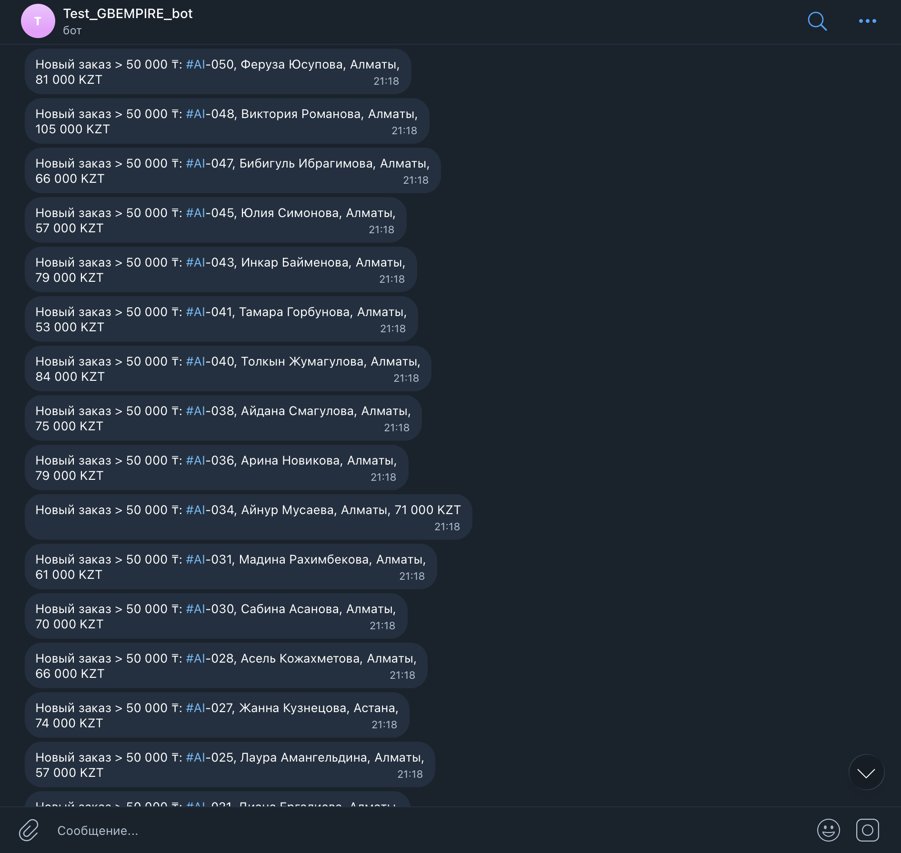

# GBC Analytics Dashboard

Тестовое задание: мини-дашборд заказов с потоком `RetailCRM -> Supabase -> Next.js dashboard`, плюс Telegram-уведомления для заказов дороже `50 000 ₸`.

## Что реализовано

- Next.js 15 + TypeScript приложение с одной страницей дашборда.
- Серверный read-model в Supabase через таблицу `orders`.
- Скрипт `import:retailcrm` для загрузки `mock_orders.json` в RetailCRM.
- Скрипт `sync:orders` для выгрузки заказов из RetailCRM и upsert в Supabase.
- Telegram-алерты для high-value заказов с защитой от дублей через `telegram_alert_sent_at`.
- Тестовая отправка Telegram-уведомления через UI дашборда и `POST /api/telegram/test`.
- API routes:
  - `GET /api/health`
  - `POST /api/sync`
  - `POST /api/telegram/test`
- `vercel.json` с cron-конфигом для автоматического sync на Vercel.

## Результат

- Production dashboard: [https://gbc-analytics-dashboard-eight.vercel.app](https://gbc-analytics-dashboard-eight.vercel.app)
- GitHub repository: [https://github.com/Detlaff00/gbc-analytics-dashboard](https://github.com/Detlaff00/gbc-analytics-dashboard)
- Telegram alerting проверен на реальных заказах после импорта в RetailCRM
- В Supabase оставлены только реальные записи после импорта и sync: `50` заказов, `24` Telegram-алерта без дублей

## Архитектура

### Поток данных

1. `mock_orders.json` загружается в RetailCRM через `npm run import:retailcrm`
2. `npm run sync:orders` тянет заказы из RetailCRM API
3. На этапе sync каждый заказ нормализуется mapper-ом
4. Нормализованные записи upsert-ятся в Supabase таблицу `orders`
5. Для заказов с `total_amount > 50000` отправляется Telegram-уведомление
6. Дашборд читает только Supabase и не ходит в RetailCRM из браузера

### Ключевые файлы

- `src/lib/order-mapper.ts` — нормализация заказа RetailCRM в строку БД
- `src/lib/sync-orders.ts` — orchestration sync + Telegram alerting
- `src/lib/dashboard.ts` — серверная агрегация для дашборда
- `scripts/import-retailcrm.ts` — первичная загрузка `mock_orders.json`
- `scripts/sync-orders.ts` — ручной запуск sync
- `supabase/migrations/20260412100000_create_orders.sql` — схема таблицы `orders`

## Быстрый старт

### 1. Установка зависимостей

```bash
npm install
```

### 2. Заполнение env

Создай `.env.local` на основе `.env.example`.

```bash
cp .env.example .env.local
```

Нужные переменные:

- `RETAILCRM_URL`
- `RETAILCRM_API_KEY`
- `SUPABASE_URL`
- `SUPABASE_SERVICE_ROLE_KEY`
- `NEXT_PUBLIC_SUPABASE_URL`
- `NEXT_PUBLIC_SUPABASE_ANON_KEY`
- `TELEGRAM_BOT_TOKEN`
- `TELEGRAM_CHAT_ID`
- `SYNC_API_SECRET` или `CRON_SECRET`

### 3. Применение миграции Supabase

SQL из файла `supabase/migrations/20260412100000_create_orders.sql` нужно применить в Supabase SQL Editor или через Supabase CLI.

### 4. Загрузка тестовых заказов в RetailCRM

```bash
npm run import:retailcrm
```

Скрипт присваивает заказам номера вида `AI-001`, `AI-002`, ... и задаёт `createdAt`, чтобы на дашборде была осмысленная динамика по дням.

### 5. Синхронизация в Supabase

```bash
npm run sync:orders
```

На этом шаге:

- заказы читаются из RetailCRM;
- `items_count` и `total_amount` пересчитываются на стороне приложения;
- выполняется upsert по `retailcrm_id`;
- отправляются Telegram-алерты только для новых high-value заказов, у которых ещё не заполнен `telegram_alert_sent_at`.

### 6. Локальный запуск дашборда

```bash
npm run dev
```

### 7. Production build

```bash
npm run build
npm start
```

## Vercel

В репозитории добавлен `vercel.json`:

```json
{
  "crons": [
    {
      "path": "/api/sync",
      "schedule": "0 9 * * *"
    }
  ]
}
```

На бесплатном Hobby-плане Vercel почасовой cron недоступен, поэтому расписание было изменено на ежедневное. Ручной запуск по-прежнему доступен через `POST /api/sync`.

Чтобы cron работал безопасно:

- задай `CRON_SECRET` в Vercel Environment Variables;
- либо задай `SYNC_API_SECRET` и вызывай endpoint вручную с `Authorization: Bearer <secret>`.

`POST /api/sync` запускает ту же логику, что и `npm run sync:orders`.

### Тест Telegram без нового заказа

На дашборде есть блок `Отправить тестовое уведомление`.

Для проверки:

1. Открой production или локальный dashboard.
2. Введи `SYNC_API_SECRET` или `CRON_SECRET` в поле `Sync secret`.
3. Нажми `Send test alert`.

После этого приложение вызовет `POST /api/telegram/test` и отправит в тот же Telegram-чат тестовое сообщение.

## Telegram alert format

Сообщение отправляется в формате:

```text
Новый заказ > 50 000 ₸: #<order_number>, <client_name>, <city>, <amount>
```

## Проверка

В проекте уже прошли:

```bash
npm test
npm run lint
npm run build
```

Дополнительно были проверены интеграции:

- `npm run import:retailcrm` успешно загрузил `50` заказов в RetailCRM;
- `npm run sync:orders` успешно синхронизировал `50` заказов в Supabase;
- Telegram alerting отработал для `24` заказов дороже `50 000 ₸`;
- повторный sync не отправляет дубли благодаря `telegram_alert_sent_at`.

## Ограничения

- GitHub integration в Vercel ещё не подключена автоматически к этому проекту, поэтому текущий production deployment был выполнен напрямую через CLI.
- Таблица `orders` сделана как единый read-model; отдельная таблица `order_items` сознательно не добавлялась, чтобы не раздувать тестовое решение.

## Как мы решали задачу с AI-инструментом

Этот проект собирался не "в один промпт", а как последовательная совместная работа с AI-инструментом в терминале. Ниже описываю фактический процесс: что я просил у AI, что он реально проверял, где мы упирались в внешние сервисы и как довели задачу до рабочего состояния.

### Что я просил сделать

Основной сценарий взаимодействия был таким:

- я дал ссылку на репозиторий и попросил сначала скачать его и составить план выполнения задания;
- после согласования плана попросил реализовать его полностью;
- по ходу работы отдельно просил помочь:
  - подключить Supabase MCP;
  - авторизоваться в Supabase;
  - объяснить, какие ключи нужны от Supabase;
  - разобраться, что делать с Vercel;
  - локально проверить проект без деплоя;
  - перепроверить, что я правильно добавил токены RetailCRM и Telegram;
  - оставить в базе только реальные данные после импорта и sync.

То есть AI использовался не как "генератор шаблона", а как инженерный помощник, который шаг за шагом собирал, запускал, проверял и дорабатывал проект.

### Как выглядело наше взаимодействие

Рабочий процесс был итеративным:

1. Сначала AI проверил локальную папку и обнаружил, что репозиторий ещё не клонирован.
2. Затем он прочитал удалённый `README.md`, нашёл формулировку задания и составил подробный план выполнения.
3. После моей команды на реализацию он:
   - клонировал репозиторий;
   - поднял Next.js + TypeScript проект;
   - добавил dashboard UI;
   - оформил серверный слой под RetailCRM, Supabase и Telegram;
   - создал SQL-миграцию под таблицу `orders`;
   - добавил `import:retailcrm`, `sync:orders`, `/api/health`, `/api/sync`, `vercel.json` и README runbook.
4. После этого мы не пошли сразу в деплой, а начали проверять всё локально и устранять реальные проблемы интеграции.

### Где мы застревали по ходу работы

Во время сборки и проверки было несколько реальных блокеров:

- в проекте изначально не было ничего, кроме `README.md` и `mock_orders.json`, поэтому весь рабочий каркас пришлось собирать с нуля;
- `next/font/google` не принял subset `cyrillic` для `Space Grotesk`;
- конфиг ESLint для Next 15 пришлось переделывать под `FlatCompat`;
- `tsx`-скрипты сначала не читали `.env.local`, поэтому import и sync падали с ошибками "не найдены переменные окружения";
- в RetailCRM дата в ISO-формате не принималась, нужен был формат `Y-m-d H:i:s`;
- в demo-аккаунте RetailCRM не существовал `orderType=eshop-individual`, доступен был только `orderType=main`;
- сначала для Telegram был добавлен только bot token, но без `TELEGRAM_CHAT_ID` сообщения отправлять было нельзя;
- для локальной проверки dashboard пришлось отдельно проверить состояние Supabase, применить миграцию и убедиться, что таблица `orders` действительно существует.

### Как эти проблемы решались

Решение происходило через короткий цикл "запуск -> ошибка -> исправление -> повторный запуск":

- AI запускал команды и реальные интеграции, а не ограничивался генерацией кода;
- по сообщениям об ошибках менялись конфиги, env, формат данных и импортер;
- по RetailCRM отдельно были запрошены реальные справочники `order-types` и `order-methods`, после чего импорт был адаптирован под конкретно мой demo-аккаунт;
- по Supabase сначала была применена миграция, потом данные для локального UI были проверены через базу, затем уже выполнен реальный sync из RetailCRM;
- по Telegram сначала была проверена валидность токена через `getMe`, потом отправлено тестовое сообщение, а затем уже проверен реальный alerting pipeline.

### Что в итоге было сделано с помощью AI

С помощью этого взаимодействия удалось:

- спроектировать и собрать проектную структуру;
- реализовать dashboard на Next.js;
- настроить схему `orders` в Supabase;
- написать импорт тестовых заказов в RetailCRM;
- написать синхронизацию `RetailCRM -> Supabase`;
- реализовать Telegram-уведомления для заказов дороже `50 000 ₸`;
- настроить антидубли по уведомлениям;
- локально проверить `api/health`, dashboard, import, sync и Telegram;
- очистить тестовые временные данные и оставить в базе только реальные записи, пришедшие после импорта в RetailCRM.

### Какой результат дала такая работа

Главная польза AI в этом задании была не в том, что он "написал код по описанию", а в том, что он:

- быстро собирал рабочие части проекта;
- сам запускал команды и проверки;
- читал реальные ответы сервисов;
- исправлял код по фактическим ошибкам;
- помог довести задачу до рабочего end-to-end сценария.

Итоговый процесс получился именно совместным: я задавал направление, предоставлял доступы и уточнял, что нужно проверить, а AI последовательно реализовывал код, запускал проверки, находил блокеры и снимал их по месту.



